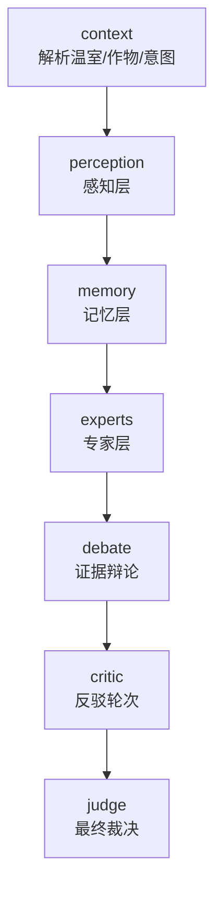

# 小模型与 Agent 编排方案

## 核心原则

系统不要让一个大模型直接处理所有问题，而是按“便宜、确定、可解释优先”的顺序编排：

1. 规则与小模型先处理结构化/窄任务。
2. 专家 Agent 聚合证据，形成领域判断。
3. Debate 只比较证据冲突，不直接拍脑袋。
4. Judge 最后裁决，必要时调用 DeepSeek 进行结构化总结。
5. 任一模型失败时，回退到规则编排和人工复核建议。

## 当前 LangGraph 主图



## 小模型与 Agent 分工

| 层级 | Agent | 模型/方法 | 输入 | 输出 | 适合任务 |
|---|---|---|---|---|---|
| 感知层 | 视觉Agent | Swin/ViT 小视觉模型 | 叶片图片 | 病害类别、置信度 | 叶片病斑识别 |
| 感知层 | 传感器Agent | 规则 + IsolationForest/LSTM/Chronos 预留 | 温湿度/土壤/CO2 | 异常分数、异常类型 | 实时异常检测 |
| 感知层 | 天气Agent | API/规则摘要 | 天气数据 | 外部风险、灌溉天气 | 气象风险输入 |
| 记忆层 | RAG | Qdrant + embedding，当前内存检索 | 症状/作物 | 候选知识片段 | 农业知识召回 |
| 记忆层 | 知识图谱 | Neo4j+AgriKG 优先、DISEASE_DB 兜底 | 作物/阶段 | 最优环境约束 | 约束校验 |
| 记忆层 | 历史案例库 | 相似案例检索 | 症状/环境 | 相似案例 | 经验复用 |
| 专家层 | 病理Agent | 规则 + RAG，可升级小语言模型 | 症状+环境+视觉 | 病害判断 | 诊断 |
| 专家层 | 栽培Agent | 规则 + 作物指南 | 环境+作物阶段 | 管理建议 | 通风/水肥/温控 |
| 专家层 | 气象Agent | 规则 + 天气摘要 | 天气/灌溉需求 | 气象建议 | 灌溉窗口 |
| 裁决层 | Critic | 规则反驳（冲突降权） | debate 冲突 + 专家输出 | 反驳裁决、降权 | 二次裁决 |
| 裁决层 | Judge | 规则 fallback + DeepSeek 可选 | 全部证据 | 决策、置信度、行动计划 | 最终输出 |

## 编排策略

### 1. 诊断类问题

用户描述“黄斑、霉层、虫害、枯萎”等症状时：

1. `context` 识别作物、温室和 `diagnose` 意图。
2. `perception` 并行/顺序采集视觉、传感器、天气证据。
3. `memory` 检索 RAG、知识图谱约束、历史案例。
4. `experts` 让病理/栽培/气象 Agent 分别给结论。
5. `debate` 检查“视觉类别、环境条件、知识库症状”是否一致。
6. `judge` 输出首选诊断、置信度和操作建议。

### 2. 灌溉类问题

用户问“要不要浇水、什么时候灌溉”：

1. 传感器 Agent 检查土壤水分和棚内湿度。
2. 气象 Agent 检查未来降雨、高温、大风。
3. 栽培 Agent 检查作物阶段和病害风险。
4. Debate 处理冲突：如“天气建议灌溉，但棚内湿度高、真菌风险高”。
5. Judge 给出是否灌溉、时间窗口和约束条件。

### 3. 预警类问题

用户问“有什么风险、需要注意什么”：

1. 感知层先聚合所有预警源。
2. 记忆层补充作物风险阈值。
3. 专家层给出风险排序。
4. Judge 输出优先级最高的 3-5 个动作。

## 小模型路由规则

- 图片存在：调用视觉模型；图片不存在：视觉 Agent 输出缺失证据，不阻塞流程。
- 传感器数据存在：先跑规则/异常检测；未来再按成本升级到 Chronos/LSTM。
- 知识检索命中低：降低病理置信度，要求补充症状或图片。
- 多源冲突：进入 Debate，不直接给高置信度结论。
- Judge 可用 DeepSeek 时：让 DeepSeek 只做“证据裁决和表达”，不要让它绕过工具直接臆断。

## 推荐落地顺序

1. 保持当前 LangGraph 主图，稳定节点输入输出 schema。
2. 将视觉 Agent 接真实图片测试集，确定可用类别映射。
3. 将 RAG 从内存检索替换为 Qdrant。（已完成混合检索 MVP：Qdrant 优先、内存兜底）
4. 将 Judge 升级为 KG 锚定的结构化裁决（已完成：KG 作为客观参照系做一致性检查，DeepSeek 可选，规则 Judge 保留 fallback）。
5. 逐步把传感器异常从规则替换为 IsolationForest/Chronos。


## DeepSeek Judge 当前实现

本轮升级后，DeepSeek 不再作为任意工具调用主循环，而是挂在最终 `JudgeAgent`：

1. `context/perception/memory/experts/debate` 仍由主图和小模型/规则完成。
2. `JudgeAgent` 将 `RequestContext`、所有 `AgentOutput`、`DebateResult` 打包为结构化 JSON。
3. DeepSeek 只允许输出 `summary`、`decision`、`confidence`、`risk_level`、`action_plan`。
4. 如果缺少 `DEEPSEEK_API_KEY`、网络失败或 JSON 解析失败，自动回退 `_run_rule_judge()`。
5. CLI 用 `--llm-judge` 显式启用，默认保持离线规则裁决，保证 demo 稳定。

验证命令：

```powershell
python orchestrator.py --llm-judge "温室A番茄叶片黄斑，叶背有灰色霉层，如何处理？"
python evals/smoke_eval.py
```


## RAG/Qdrant 当前实现

记忆层现在通过 `rag.retriever.retrieve_with_backend()` 工作：

1. `AGRI_AI_RAG_BACKEND=auto` 时优先访问 Qdrant。
2. Qdrant 未启动、collection 不存在、网络失败或空命中时，自动回退内存 `search_disease()`。
3. 检索 hit 固定包含 `id`、`title`、`crop`、`text`、`score`、`source`、`metadata`。
4. `RagMemoryAgent` 在 evidence 中记录 `backend=qdrant|memory|fallback`，供 Judge 和评估脚本追踪。
5. 当前 embedding 是本地确定性 hash embedding，不需要下载模型；后续替换真实 embedding 时应新建 collection 版本。

常用命令：

```powershell
docker compose up -d qdrant
python -m rag.retriever --index
python -m rag.retriever --query "番茄叶背灰色霉层" --crop tomato
```


## KG 锚定 Judge 当前实现

Judge 不再直接相信单一专家，而是把农业知识图谱当作“教科书级常识”做一致性检查：

1. `kg_adapter.query_kg(crop, query)` 为混合 KG：`AGRI_AI_KG_BACKEND=auto` 时优先查 Neo4j+AgriKG，不可用或空命中时回退内置 `DISEASE_DB` 合成；返回固定字段 `diseases/triples/triple_strings/rules/hard_constraints` 外加 `backend=neo4j|memory|fallback`。
2. 规则 Judge 执行第 3 步硬约束否决：例如某高湿病害要求湿度>85%，但传感器湿度明显偏低（<阈值×0.6）时，该病理诊断被否决、置信度封顶 0.6、触发人工复核。
3. DeepSeek Judge（`--llm-judge`）使用 5 步裁决 Prompt：KG 一致性校验 → 专家交叉验证 → 硬约束否决 → 证据权重打分 → 置信度融合；严重冲突时置信度上限 0.7 并触发 `need_human_review`。
4. `DecisionOutput` 新增 `need_human_review`、`reasoning_trace`、`judge_analysis`，CLI/API/UI 均可透出。
5. `kg_adapter` 现已接入真实 AgriKG（Neo4j 优先、`DISEASE_DB` 兜底）。Neo4j 命中时把 AgriKG 的 `:Disease` 实体与 `:RELATION` 三元组合并进记忆基线（记忆疾病在前，保证病理诊断的 KG 匹配不被削弱）；硬约束仍以 `DISEASE_DB` 结构化阈值为准，保证否决逻辑确定性。Judge 契约不变。

KG 环境变量：

- `AGRI_AI_KG_BACKEND`：默认 `auto`，可选 `auto|neo4j|memory`
- `NEO4J_URI` / `NEO4J_USER` / `NEO4J_PASSWORD`：默认 `bolt://localhost:7687` / `neo4j` / `neo4j`

> 真实图谱需先用 `agri-agent-mvp/scripts/import_agrikg.py` 导入 AgriKG；未导入时 `kg_adapter.py --status` 显示 `effective_backend=memory`，系统照常离线运行。

验证命令：

```powershell
python kg_adapter.py --crop tomato --query "叶片黄斑，叶背灰色霉层"
python orchestrator.py "温室A番茄叶片黄斑，叶背有灰色霉层，如何处理？"
python orchestrator.py --json "温室A番茄叶片黄斑，叶背有灰色霉层，如何处理？"
```


## Critic 反驳轮次（debate → critic → judge）

主图在 debate 与 judge 之间新增 `critic` 节点（`debate/critic.py`），实现"争论 → 反驳 → 再裁决"闭环：

1. `DebateEngine` 报告冲突时，`CriticEngine` 执行一轮确定性反驳：识别对立双方（如"气象建议灌溉" vs "棚内湿度偏高/病害风险"），依据传感器读数 + 症状强度衡量证据。
2. 对较弱一方置信度降权（如气象Agent 0.72→0.43）并写入 `DebateResult.critic`；无法判定胜负时升级人工复核。
3. Judge 据此调整融合与 `need_human_review`，`format_decision` 透出【Critic 反驳轮次】。
4. 无冲突时 Critic 为空操作，冲突-free 的运行行为完全不变（最小扰动）。
5. 可选 LLM 模式（`--llm-critic`）：用 DeepSeek 对冲突做结构化反驳裁决（输出 winner/loser/resolution/adjustments），据此调整置信度；无 key 或调用失败时自动回退规则模式。`AGRI_AI_CRITIC_MODEL` 可指定模型，默认 `deepseek-chat`。
6. 多轮反驳：LLC 模式下若某轮 `escalate=true` 且未达 `max_rounds`（默认 2），会带上一轮结论再裁决一轮，最终仍无法判定才升级人工复核；每轮结果记入 `DebateResult.critic.rounds_log`。

验证命令：

```powershell
python evals/smoke_eval.py      # 3 套回归
python evals/fixture_eval.py    # 12 个确定性场景（crop/intent/病害 断言）
```

## 目录收编

AgriKG 相关代码已收编进主项目：`kg/mcp_server.py`（MCP Server）、`scripts/import_agrikg.py`（导入脚本）、`scripts/AGRiKG_SETUP.md`（集成指南）。`kg_adapter.py` 为 Judge 提供混合 KG 检索（Neo4j 优先、DISEASE_DB 兜底）。

## 支持作物

当前重点支持 **番茄 / 甜菜 / 棉花** 三种作物：`DISEASE_DB` 内置番茄叶霉病/早疫病、甜菜褐斑病/根腐病、棉花黄萎病/枯萎病；`FARMING_GUIDE` 与 `_extract_crop` 同步覆盖。真实 AgriKG（Neo4j）还会为这些作物补充更多病害实体与关系三元组。
