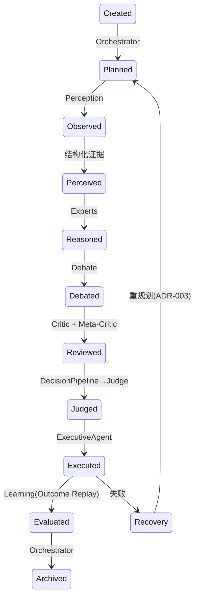
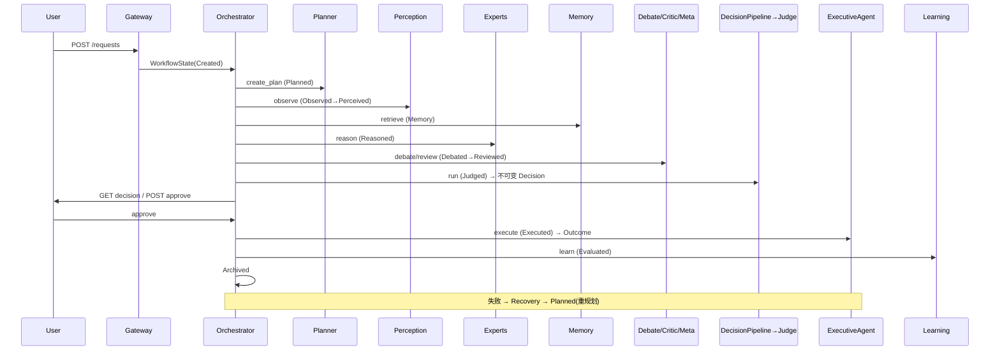

# ACIS v0.1 Implementation Architecture

> 本文档设计 ACIS v0.1 可运行工程结构。
> 严格遵守 RFC-000~010 与 ADR-001~004；不新增架构模块；不实现 Future RFC。
> 仅含接口定义与结构设计，不含业务代码。

---

# 0. 设计约束（源自 RFC / ADR）

- **ADR-001**：RFC-001 为唯一架构源；分层与归属以 RFC-001 为准。
- **ADR-002**：World Model 为预留接口，v0.1 不实现，仅保留 `world_model` 命名空间；Planner ↔ World Model 为可选增强。
- **ADR-003**：RFC-002 工作流生命周期为外层规范状态机；RFC-008/006/009 为内层循环；新增 `Planned` 子状态与 `Recovery/Replan` 转移（向后兼容扩展）；Decision Pipeline ⊃ Judge；行动规划按任务级/决策级/执行级切分。
- **ADR-004**：RFC-009 Executive Agent 归属 Execution Layer。
- **RFC-001 约束**：Agent 不直连基础设施（必经 Tool Layer）；Memory 不推理；Judge 不造事实；历史不可变（append-only）；每模块可独立测试；Tool 须 MCP 化。
- **ACIS 原则**：Adopt Before Build（优先成熟 OSS）、Polyglot（v0.1 选 Python）。

---

# 1. v0.1 范围

| 类别 | v0.1 状态 | 依据 |
|---|---|---|
| Workflow Runtime（Orchestrator/Gateway/WorkflowState） | ✅ 实现 | RFC-002 / Phase 0 |
| Agent Framework（基类 + 感知/专家/认知 Agent） | ✅ 实现 | RFC-003 / Phase 0 |
| Memory Layer（Semantic/Episodic/KG/Outcome Replay） | ✅ 实现（Procedural 最小） | RFC-004 / Phase 0 |
| Tool Layer（Registry/Router/MCP Adapter + 基础工具） | ✅ 实现 | RFC-005 / Phase 0 |
| Decision Pipeline（Context/Reasoning/Evaluator/Selector/Judge） | ✅ 实现 | RFC-006 / Phase 0 |
| Planner Interface | 🟡 接口 + 最小线性实现 | RFC-008 / Phase 1 全功能 |
| Execution Interface | 🟡 接口 + 最小实现（通知/工单 + 人工审批） | RFC-009 / Phase 3 全功能 |
| Learning Interface | 🟡 接口 + 最小实现（Outcome Replay） | RFC-007 / Phase 2 全功能 |
| World Model | 🔵 仅预留接口（不实现） | RFC-010 / ADR-002 / Phase 3 |

---

# 2. Python Package Structure

包根 `acis/`（位于工程目录，可导入为 `acis`）。每个子包映射到一个 RFC，不引入 RFC 外模块。

```
acis/
├── __init__.py
├── config.py                      # 配置（工程基础设施，非架构模块）
│
├── workflow/                      # RFC-002 Workflow State + Runtime
│   ├── __init__.py
│   ├── state.py                   # WorkflowState 及各 section
│   ├── lifecycle.py               # 生命周期状态 + 转移（含 Planned / Recovery，ADR-003）
│   ├── ownership.py               # 状态归属注册与越权校验
│   ├── validation.py              # 入 Judge 前校验（RFC-002 §11）
│   ├── orchestrator.py            # Orchestrator：驱动外层状态机，拥有 Metadata
│   └── gateway.py                 # Gateway：请求入口，拥有 Request
│
├── agents/                        # RFC-003 Agent Protocol
│   ├── __init__.py
│   ├── base.py                    # Agent 基类 / AgentInput / AgentOutput / Capability
│   ├── registry.py                # Agent 注册 + 按能力调度
│   ├── perception/                # Perception Agent
│   │   ├── weather.py
│   │   ├── sensor.py
│   │   └── vision.py
│   ├── experts/                   # Expert Agent
│   │   ├── pathology.py
│   │   ├── cultivation.py
│   │   └── meteorology.py
│   └── cognitive/                 # Cognitive Agent（集体智能）
│       ├── debate.py
│       ├── critic.py
│       ├── meta_critic.py
│       └── judge.py
│
├── memory/                        # RFC-004 Memory System
│   ├── __init__.py
│   ├── base.py                    # Memory 接口 / MemoryItem（source/confidence/timestamp/verification/citation/score）
│   ├── semantic.py                # Semantic Memory（RAG）
│   ├── episodic.py                # Episodic Memory（Case）
│   ├── procedural.py              # Procedural Memory（Outcome）— v0.1 最小
│   ├── knowledge_graph.py         # Knowledge Graph
│   ├── outcome_replay.py          # Outcome Replay
│   ├── fusion.py                  # Memory Fusion（不做最终决策）
│   └── retrieval.py               # Retrieval Pipeline
│
├── tools/                         # RFC-005 Tool Protocol
│   ├── __init__.py
│   ├── base.py                    # Tool 接口 / ToolRequest / ToolResponse
│   ├── registry.py                # Tool Registry
│   ├── router.py                  # Tool Router
│   ├── mcp_adapter.py             # MCP Adapter
│   ├── permissions.py             # 权限边界（read/write/high-risk）
│   ├── logging.py                 # 调用日志
│   └── impl/                      # 具体工具
│       ├── kg_query.py
│       ├── rag_search.py
│       ├── weather.py
│       └── sensor.py
│
├── decision/                      # RFC-006 Decision Pipeline
│   ├── __init__.py
│   ├── context.py                 # Context Builder
│   ├── reasoning.py               # Reasoning Core
│   ├── evaluator.py               # Decision Evaluation
│   ├── selector.py                # Decision Selection（终止于 Judge）
│   ├── trace.py                   # Decision Trace
│   └── pipeline.py                # DecisionPipeline 编排
│
├── planner/                       # RFC-008 Planner（接口 + v0.1 最小）
│   ├── __init__.py
│   ├── interface.py               # Planner 协议（Goal/TaskGraph/Plan）
│   ├── goal.py                    # Goal Analyzer（接口，Phase 1）
│   ├── decomposer.py              # Task Decomposer（接口，Phase 1）
│   ├── generator.py               # Plan Generator（任务级）
│   ├── evaluator.py               # Plan Evaluator（接口，Phase 1）
│   ├── replanner.py               # Replanner（接口，Phase 1）
│   ├── graph.py                   # Task Graph
│   └── default.py                 # DefaultPlanner：v0.1 线性最小实现
│
├── executor/                      # RFC-009 Execution（接口 + v0.1 最小）
│   ├── __init__.py
│   ├── interface.py               # ExecutiveAgent 协议（Action/Loop）
│   ├── controller.py              # Task Controller（执行级）
│   ├── action.py                  # Action 模型
│   ├── executor.py                # Tool Executor
│   ├── observer.py                # Observation Handler
│   ├── recovery.py                # Error Recovery（v0.1 仅 Retry）
│   ├── loop.py                    # Execution Loop
│   └── impl/                      # 最小执行器
│       ├── notification.py
│       └── work_order.py
│
├── learning/                      # RFC-007 Learning（接口 + v0.1 最小）
│   ├── __init__.py
│   ├── interface.py               # LearningPipeline 协议
│   ├── experience.py              # Experience 模型 + Collector（v0.1 实现）
│   ├── reflection.py              # Reflection（接口，Phase 2）
│   ├── analyzer.py                # Learning Analyzer（接口，Phase 2）
│   ├── optimizer.py               # Improvement Generator（接口，Phase 2）
│   ├── validator.py               # Validation System（接口，Phase 2）
│   └── updater.py                 # Behavior Update（接口，Phase 2）
│
├── world/                         # RFC-010 World Model（预留，ADR-002）
│   ├── __init__.py
│   └── interface.py               # WorldModel 协议桩（不实现）
│
├── api/                           # API Interface（Gateway 对外，RFC-002 Request owner）
│   ├── __init__.py
│   ├── rest.py                    # REST 端点
│   └── schemas.py                 # 请求/响应 schema
│
├── storage/                       # 存储边界（RFC-004 §15 解耦，工程基础设施）
│   ├── __init__.py
│   ├── base.py                    # 存储后端接口
│   ├── vector.py                  # 向量库适配（Qdrant/FAISS）
│   ├── graph_db.py                # 图库适配（Neo4j）
│   ├── relational.py              # 工作流/案例/结果存储（SQLite/Postgres）
│   └── object_store.py            # 产物/附件
│
└── telemetry/                     # RFC-002 Telemetry（owner=Infrastructure）
    ├── __init__.py
    └── logging.py

tests/                             # 测试（见 §16）
├── unit/
├── integration/
├── contract/
└── e2e/
```

> `api/`、`storage/`、`telemetry/`、`config.py` 为工程基础设施，分别对应 RFC-002 Gateway/Infrastructure owner 与 RFC-004 存储解耦，非新增认知架构模块。

---

# 3. Module Ownership（模块归属）

| 包 | RFC | 拥有的 Workflow State 区段 | 角色 |
|---|---|---|---|
| workflow.orchestrator | 002 | Metadata | 外层状态机驱动 |
| workflow.gateway | 002 | Request | 请求入口 |
| planner | 008 | Context | 任务级规划（Planned 阶段） |
| agents.perception | 003 | Observation | 感知 |
| agents.experts | 003 | Evidence | 专家推理 |
| memory | 004 | Memory | 检索（不推理） |
| agents.cognitive.debate | 003 | Debate | 辩论 |
| agents.cognitive.critic | 003 | Critic | 批评 |
| agents.cognitive.meta_critic | 003 | MetaCritic | 元批评 |
| decision (+ judge) | 006 | Decision | 决策管线，Judge 终止裁决 |
| executor | 009 | Execution | 执行级行动 |
| (feedback) | 002 | Outcome | 结果收集（Execution 包内 observer） |
| learning | 007 | Learning | 经验/Outcome Replay |
| telemetry | 002 | Telemetry | 可观测性 |
| world | 010 | world_model（预留） | 不实现 |

---

# 4. Workflow Runtime（RFC-002 + ADR-003）

## 4.1 外层状态机



- `Planned` 与 `Recovery` 为 ADR-003 向后兼容扩展。
- v0.1 在无完整 Planner 时，`Planned` 由 `DefaultPlanner` 产出单步线性计划。

## 4.2 WorkflowState 结构（RFC-002 §5）

```
WorkflowState
├── Metadata        (Orchestrator)   不可变: request_id/session_id/created_at/user_input/workflow_version
├── Request         (Gateway)
├── Context         (Planner)         + Planned 子状态
├── Observation     (Perception)
├── Evidence        (Experts)
├── Memory          (Memory Layer)
├── Debate          (Debate Engine)
├── Critic          (Critic)
├── MetaCritic      (Meta-Critic)
├── Decision        (Judge)           不可变 Decision 对象
├── Execution       (Execution Layer)
├── Outcome         (Feedback Layer)
├── Learning        (Learning Layer)
├── Telemetry       (Infrastructure)
└── world_model     (预留命名空间, ADR-002)
```

- 不可变字段：request_id、session_id、created_at、user_input、workflow_version。
- 可变状态 append-first；禁止删除/改写历史。
- 入 Judge 前校验（RFC-002 §11）：至少一个 Expert Output + Evidence + Confidence + Memory Retrieval + Debate Result。

## 4.3 Orchestrator / Gateway 职责

- **Gateway**：接收请求 -> 构造 WorkflowState(Created) -> 交 Orchestrator；对外暴露 API（§13）。
- **Orchestrator**：按外层状态机推进；每阶段调用对应 owner；校验归属与状态契约；失败走 Recovery；归档。

---

# 5. Agent Framework（RFC-003）

## 5.1 接口

```python
from typing import Protocol, Any
from dataclasses import dataclass, field

@dataclass
class AgentInput:
    request_id: str
    workflow_state: Any          # WorkflowState（只读视图）
    context: dict
    inputs: dict
    memory: list                 # 已检索记忆
    configuration: dict

@dataclass
class AgentOutput:
    agent_name: str
    category: str                # perception|expert|memory|cognitive|execution
    result: Any
    evidence: list
    confidence: float            # 0.0~1.0
    reasoning_summary: str
    execution_time: float
    version: str
    counterfactual: list = field(default_factory=list)
    citations: list = field(default_factory=list)
    warnings: list = field(default_factory=list)

@dataclass
class Capability:
    name: str
    category: str
    version: str
    inputs: list
    outputs: list
    tools: list
    supports_counterfactual: bool = False
    supports_streaming: bool = False
    supports_async: bool = True

class Agent(Protocol):
    capability: Capability
    def invoke(self, inp: AgentInput) -> AgentOutput: ...   # 结构确定性；不崩溃工作流
```

## 5.2 生命周期

`Initialized -> Ready -> Invoked -> Reasoning -> Completed -> Archived`；失败 `Reasoning -> Error -> Retry -> Completed`。

## 5.3 Registry & 调度

- `AgentRegistry` 按 `Capability` 注册；Orchestrator 按阶段选择类别（perception/expert/cognitive）。
- v0.1 实现：Weather/Sensor/Vision（感知）；Pathology/Cultivation/Meteorology（专家）；Debate/Critic/Meta-Critic/Judge（认知）。

---

# 6. Memory Layer（RFC-004）

## 6.1 接口

```python
@dataclass
class MemoryItem:
    source: str
    confidence: float
    timestamp: str
    verification_status: str     # verified|unverified
    citation: str
    retrieval_score: float

class Memory(Protocol):
    def retrieve(self, query: dict) -> list[MemoryItem]: ...   # 只检索，不推理
```

## 6.2 类型与 v0.1 实现

| 类型 | 实现 | v0.1 |
|---|---|---|
| Semantic | RAG / 向量库 | ✅ |
| Episodic | Case Repository | ✅ |
| Procedural | Outcome Repository | 🟡 最小 |
| Knowledge Graph | 图库 | ✅ 只读查询 |
| Outcome Replay | 结果/反馈 | ✅ |
| Memory Evolution | 知识演进 | 🔵 接口（Phase 2） |

## 6.3 Retrieval Pipeline（RFC-004 §11）

`Request -> Planner -> Semantic -> KnowledgeGraph -> Episodic -> Procedural -> MemoryFusion -> Workflow`

- Memory Fusion 不做最终决策（归 Judge）；融合优先级：verified > structured > 成功历史 > unverified（标注）。
- 存储后端可替换（Qdrant/Milvus/Chroma/FAISS、Neo4j），workflow 仅依赖 Memory 协议。

---

# 7. Tool Layer（RFC-005）

## 7.1 接口

```python
@dataclass
class ToolRequest:
    tool_name: str
    request_id: str
    caller: str
    parameters: dict
    timeout: int = 10

@dataclass
class ToolResponse:
    status: str                  # success|failed
    tool_name: str
    data: dict
    metadata: dict = field(default_factory=dict)   # source/timestamp/confidence(provenance)

class Tool(Protocol):
    name: str
    def call(self, req: ToolRequest) -> ToolResponse: ...
```

## 7.2 结构

`Agent -> ACIS Tool Interface -> MCP Adapter -> MCP Server`（RFC-005 §12）。
- 禁止 Agent 直接 import 实现。
- 权限：read（query_weather/search_rag）/ write（create_work_order/control_device）/ high-risk（须确认）。
- 每次调用记录：tool_name/caller/timestamp/parameters/status/execution_time。
- v0.1 工具：kg_query、rag_search、weather、sensor。

---

# 8. Decision Pipeline（RFC-006 + ADR-003）

## 8.1 阶段

`Observation -> Context Construction -> Situation Understanding -> Reasoning -> Decision Evaluation -> Decision Selection -> Action Preparation`

## 8.2 接口

```python
class DecisionPipeline(Protocol):
    def run(self, state) -> Any:    # 返回不可变 Decision
        ...

@dataclass
class Decision:
    decision_id: str
    choice: str
    confidence: float
    risk: float
    evidence: list
    reasoning: str
    suggested_actions: list
    # 一经产生不可变；修订产生新版本
```

## 8.3 边界（ADR-003）

- Decision Pipeline ⊃ Judge：Context Builder/Reasoning/Evaluator 产出候选，**Judge 为终止裁决阶段**。
- RFC-002 "Decision" 状态 = Judge 输出的不可变 Decision。
- Action Planner = **决策级**（选定方案 -> 行动计划），与 RFC-008 任务级、RFC-009 执行级区分。
- Decision Trace 记录：decision_id/input/context/reasoning/action/result，append-only。

---

# 9. Planner Interface（RFC-008 + ADR-003）

## 9.1 接口

```python
@dataclass
class Goal:
    goal: str
    constraints: list
    priority: str

@dataclass
class Plan:
    plan_id: str
    goal: Goal
    tasks: list
    dependencies: list
    status: str                 # running|done|failed

class Planner(Protocol):
    def create_plan(self, goal: Goal) -> Plan: ...
    def replan(self, feedback) -> Plan: ...
```

## 9.2 v0.1 最小实现

- `DefaultPlanner`：产出单步线性 Plan（驱动认知闭环），不做分解/任务图/重规划。
- Goal Analyzer / Decomposer / Task Graph / Evaluator / Replanner：**接口定义**，实现延后 Phase 1。
- 运行阶段：`Created -> Planned`（Context 阶段，owner=Planner）。
- World Model 接入钩子预留（ADR-002 可选增强），v0.1 不启用。

---

# 10. Execution Interface（RFC-009 + ADR-003/004）

## 10.1 接口

```python
@dataclass
class Action:
    action_id: str
    type: str                    # tool_call|notification|work_order
    target: str
    input: dict
    status: str                  # pending|running|done|failed

class ExecutiveAgent(Protocol):  # 归属 Execution Layer（ADR-004）
    def execute(self, plan) -> list:   # 返回 Action 结果 + Outcome
        ...
```

## 10.2 v0.1 最小实现

- Task Controller（执行级）+ Tool Executor + Observation Handler。
- 执行器：notification、work_order。
- Human-in-the-loop：高风险 Action 须 `approve` 后执行（Safety Verification 阶段）。
- Recovery：v0.1 仅 Retry；Alternative/Replanning 接口延后。
- Outcome 由 observer 收集（Feedback Layer owner=Outcome）。
- 运行阶段：`Judged -> Executed`。

---

# 11. Learning Interface（RFC-007 + ADR-003）

## 11.1 接口

```python
@dataclass
class Experience:
    exp_id: str
    task: str
    state: Any
    decision: Any
    action: Any
    result: str                  # effective|partial|ineffective|unknown
    feedback: str

class LearningPipeline(Protocol):
    def learn(self, experience: Experience) -> None: ...   # v0.1 仅记录；不直接改行为
```

## 11.2 v0.1 最小实现

- Experience Collector + Outcome Replay（记录结果、反馈、置信度）。
- Reflection / Analyzer / Optimizer / Validator / Updater：**接口定义**，实现延后 Phase 2。
- 学习不直接修改行为，须生成 Proposal 并验证（RFC-007 §2.2）。
- 运行阶段：`Executed -> Evaluated`。

---

# 12. World Model（预留，RFC-010 + ADR-002）

```python
class WorldModel(Protocol):     # 仅接口桩，v0.1 不实现
    def update(self, observation) -> None: ...
    def predict(self, action): ...
```

- `acis/world/interface.py` 仅定义协议；无实现、无存储。
- WorkflowState 保留 `world_model` 命名空间（RFC-002 §10）。
- 完整实现 Phase 3；Planner 可选增强，v0.1 不启用。

---

# 13. API Interface（Gateway，RFC-002 Request owner）

| 方法 | 路径 | 说明 |
|---|---|---|
| POST | /api/v1/requests | 提交用户请求 -> 创建 Workflow(Created) |
| GET | /api/v1/workflows/{id} | 查询工作流状态/当前阶段 |
| GET | /api/v1/workflows/{id}/decision | 获取 Decision + Trace |
| POST | /api/v1/workflows/{id}/approve | 人工审批执行（Human-in-the-loop） |
| POST | /api/v1/workflows/{id}/feedback | 提交结果反馈（Outcome） |
| GET | /api/v1/agents | 列出 Agent 能力 |
| GET | /api/v1/tools | 列出工具 |
| WS | /api/v1/workflows/{id}/stream | 阶段/遥测流（可选） |

请求/响应 schema 由 `api/schemas.py` 定义（Pydantic），与 AgentInput/AgentOutput、WorkflowState section 对齐。

---

# 14. 数据库 / 存储边界

| 存储 | 用途 | v0.1 后端 | RFC | 规则 |
|---|---|---|---|---|
| Workflow Store | WorkflowState + 事件日志 | SQLite/Postgres | 002 | append-only；不可变字段 |
| Vector Store | Semantic Memory | Qdrant/FAISS | 004 | 可替换 |
| Graph DB | Knowledge Graph | Neo4j | 004 | 可替换；v0.1 只读 |
| Case Store | Episodic Memory | SQLite/Postgres | 004 | append-only |
| Outcome Store | Procedural + Outcome Replay | SQLite/Postgres | 004 | append-only |
| Decision Trace Store | Decision Trace | SQLite/Postgres | 006 | append-only |
| Tool Log Store | 工具调用日志 | SQLite/文件 | 005 | append-only |

- 存储后端经 `storage/` 适配，认知层仅依赖协议（RFC-004 §15）。
- Agent 不直连存储；必经 Tool Layer（RFC-001 约束）。
- 历史记录不可变；知识演进 append-only（Draft->Review->Approved->Merged）。

---

# 15. Runtime Flow（端到端）



---

# 16. 测试策略

- **Unit**：每模块独立可测（RFC-001 指标）。Mock Tool/Memory；验证 Agent I/O schema、状态归属、校验规则。
- **Contract**：RFC-002 状态归属与不可变字段；RFC-003 AgentInput/Output；RFC-005 ToolRequest/Response schema；RFC-006 Decision 不可变。
- **Integration**：阶段衔接（Planner→Perception→Experts→Debate→Judge→Execution→Learning）、Memory 检索管线、Tool 经 MCP 调用。
- **E2E**：完整认知闭环（fixture 数据，沿用 `evals/fixtures.py` 模式）；验收 = 单请求跑完全链路且状态可观测、决策可解释。
- **Regression**：必须保持全绿（RFC-001 指标）；禁止删除回归测试（ACIS 工程规则）。
- **ADR 合规**：自动校验 World Model 未被实例化、Planner 可在无 World Model 下运行、Judge 为 Decision 终止者。

---

# 17. v0.1 实现矩阵

| 模块 | 实现 | 接口 | 延后 |
|---|---|---|---|
| Workflow Runtime | ✅ | — | — |
| Agent Framework | ✅ | — | — |
| Memory | ✅（Procedural 最小） | Memory Evolution | Phase 2 |
| Tool Layer | ✅ | — | 全面 MCP 化 Phase 1 |
| Decision Pipeline | ✅ | — | — |
| Planner | DefaultPlanner | 全套 | Phase 1 |
| Execution | 通知/工单+审批 | Recovery 全套 | Phase 3 |
| Learning | Outcome Replay | Reflection/Analyzer/Optimizer/Validator/Updater | Phase 2 |
| World Model | — | 协议桩 | Phase 3 |

---

# 18. 合规性检查（RFC / ADR 映射）

- [x] 分层与归属遵循 RFC-001 / ADR-001
- [x] World Model 仅预留接口，未实现 / ADR-002
- [x] 外层状态机 + Planned/Recovery + 内层循环 / ADR-003
- [x] Decision Pipeline ⊃ Judge；行动规划三级切分 / ADR-003
- [x] Executive Agent 归 Execution Layer / ADR-004
- [x] Agent 不直连基础设施；Tool MCP 化 / RFC-001/005
- [x] Memory 不推理；Judge 不造事实 / RFC-001/004
- [x] 历史不可变、append-only / RFC-002/004
- [x] 每模块可独立测试 / RFC-001
- [x] 未引入 RFC 外架构模块；未实现 Future RFC

---

# 19. 后续

- 本文档为 v0.1 工程结构设计，待确认后进入实现。
- Phase 1/2/3 的完整 Planner/Learning/Executive/World Model 按 IMPLEMENTATION_PLAN 推进，届时扩展对应接口为实现。
