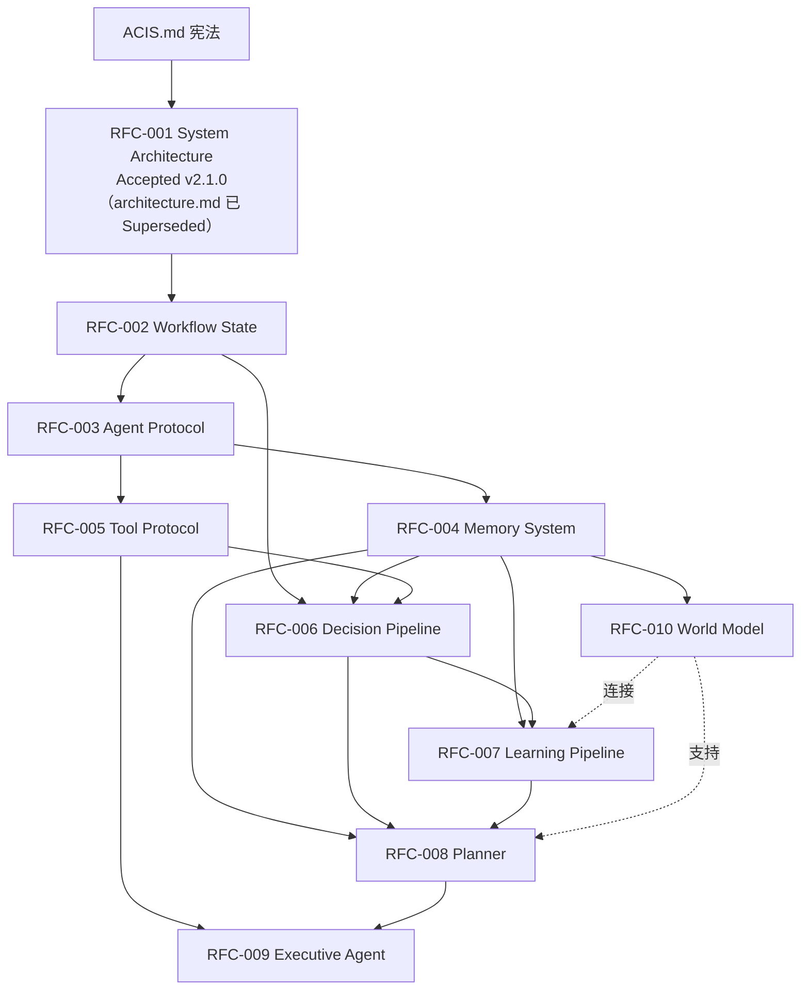

# ACIS Implementation Plan

> 本文档基于 RFC-000 ~ RFC-014 及 ACIS.md / architecture.md / roadmap.md 综合分析生成。
> RFC-011 ~ RFC-014 为面向 ACIS 4.x/5.x 的前瞻性规格（认知循环 / 自我模型 / 目标动机 / 智能体生态），超出当前 roadmap（至 3.0）范围，仅在 §4.3 标注归属，不在近期实施计划内落地。
> 本文档不引入 RFC 之外的任何新架构，不增加未经定义的模块。
> 如实现与 RFC 冲突，以 RFC 与 ACIS.md 为准。

---

# 1. ACIS 整体架构总结

## 1.1 定位与使命

ACIS（Agricultural Cognitive Intelligence System，农业认知智能系统）的目标是成为**农业认知操作系统**，而非聊天机器人、病害分类器或多 Agent 演示。

核心能力闭环：

```
Observe -> Understand -> Reason -> Debate -> Decide -> Execute -> Learn -> Improve
```

演进分为五代：1.x 单 Agent -> 2.x 多 Agent 认知 -> 3.x 执行智能 -> 4.x 自主农业智能 -> 5.x 农业认知操作系统。当前处于 ACIS 2.0（多 Agent 认知决策）。

## 1.2 分层架构

依据 architecture.md，ACIS 为分层认知架构，每层单一职责：

| 层 | 职责 | 关键约束 |
|---|---|---|
| Executive Intelligence Layer | 协调整体认知流程：规划、调度、资源分配、工作流生成、安全检查 | 不诊断、不存知识、不直接操作硬件 |
| Tool Layer | 对所有外部能力的统一接口（MCP） | Agent 不得直接访问基础设施 |
| Perception Layer | 原始观测 -> 结构化证据（Vision/Sensor/Weather/Spectral/Drone） | - |
| Cognition Layer | 领域解释（Pathology/Cultivation/Meteorology/Economic/Ecology） | 专家不产生最终决策 |
| Memory Layer | Semantic / Episodic / Procedural + Knowledge Graph + Outcome Replay | Memory 不推理，只检索 |
| World Model | 农业世界内部表示（预留接口，未来实现） | - |
| Collective Intelligence | Experts -> Debate -> Critic -> Meta-Critic -> Consensus -> Judge | 每阶段降低不确定性 |
| Decision Layer | Judge：证据融合、风险评估、置信度校准、策略检查 | Judge 不得创造事实 |
| Execution Layer | 决策 -> 行动（IoT/Drone/PLC/工单/通知/人工审批） | 高风险需人工确认 |
| Learning Pipeline | Outcome -> Evaluation -> Replay -> Memory Update -> Knowledge Evolution -> Confidence Calibration | 不直接改历史，只提议改进 |

## 1.3 设计原则（摘要）

Evidence First、Explainability、Memory Never Rewrites History、Debate Before Decision、Safety Before Automation、Continuous Learning、Human-in-the-loop、Tool Isolation、Evolution Without Destruction、Adopt Before Build、Polyglot、Evolve with Ecosystem。

## 1.4 架构硬约束

- Agent 永不直接访问基础设施（必经 Tool Layer）
- Memory 永不推理
- Judge 永不创造事实
- 历史记录不可变（append-only）
- 每个 Workflow State 必须可观测
- 每个决策必须可解释
- 每个模块必须可独立测试
- 每个架构变更必须有 ADR

---

# 2. RFC 依赖关系分析

## 2.1 依赖图



## 2.2 依赖链说明

- **地基层**：ACIS.md -> RFC-001（架构）-> RFC-002（Workflow State，全局唯一状态源）-> RFC-003（Agent Protocol，统一 Agent 协议）。
- **能力分支**（可并行）：RFC-004 Memory、RFC-005 Tool，二者均依赖 001/002/003。
- **认知主干**：RFC-006 Decision Pipeline 依赖 002/004/005，是认知核心。
- **进化链**：RFC-007 Learning 依赖 004/006；RFC-008 Planner 依赖 004/006/007；RFC-009 Executive Agent 依赖 005/008。
- **世界模型**：RFC-010 World Model 依赖 RFC-004，并向 RFC-008（Planner）与 RFC-007（Learning）提供支持。

## 2.3 关键依赖约束

- RFC-002 是所有节点的共享状态契约，必须最先稳定。
- RFC-003 是所有 Agent 的统一协议，任何 Agent 实现前必须先定义。
- RFC-004 / RFC-005 可并行开发，但都阻塞 RFC-006。
- RFC-006 阻塞 007/008；RFC-008 阻塞 009。
- RFC-010 在依赖图上是 Planner 的"支持者"，按 RFC-010 §12 应先于 Planner 可用；但 roadmap 将其置于 ACIS 3.0（见 §6 冲突 C3）。

---

# 3. 必须实现的核心模块

> 以下模块均来自 RFC 定义，未引入 RFC 外模块。

## 3.1 模块清单（按 RFC 映射）

| RFC | 核心模块 | 实现时机 |
|---|---|---|
| RFC-002 | WorkflowState（Metadata/Request/Context/Observation/Evidence/Memory/Debate/Critic/MetaCritic/Decision/Execution/Outcome/Learning/Telemetry）、Orchestrator、Gateway、State Ownership 校验、State Validation | ✅ MVP |
| RFC-003 | Agent 基础接口、AgentOutput schema、Capability Declaration、Agent Lifecycle、Confidence/Evidence 规范 | ✅ MVP |
| RFC-004 | Semantic Memory（RAG）、Episodic Memory（Case）、Procedural Memory（Outcome）、Knowledge Graph、Outcome Replay、Memory Fusion、Retrieval Pipeline | ✅ MVP（Procedural 全功能 P2） |
| RFC-005 | Tool Registry、Tool Router、Tool Interface、MCP Adapter、Permission、Tool Logging | ✅ MVP（MCP 全面化 P1） |
| RFC-006 | Context Builder、Reasoning Core、Decision Maker、Action Planner、Decision Trace | ✅ MVP |
| 架构 | Collective Intelligence：Experts / Debate / Critic / Meta-Critic / Judge | ✅ MVP |
| RFC-007 | Experience Collector、Learning Analyzer、Improvement Generator、Validation System、Behavior Update | 🟡 MVP 仅 Outcome Replay；完整 P2 |
| RFC-008 | Goal Analyzer、Task Decomposer、Plan Generator、Plan Evaluator、Replanner、Task Graph | 🔵 Phase 1 |
| RFC-009 | Task Controller、Action Selector、Tool Executor、Observation Handler、Recovery、Execution Loop | 🟡 MVP 仅基础 Execution；完整 P3 |
| RFC-010 | World Representation、Entity/Relationship/State Model、Causal Model、Prediction Engine、Simulator | 🔵 Phase 3 |

## 3.2 模块职责与边界（关键）

- **WorkflowState（RFC-002）**：唯一状态源，每字段单一 owner，append-first，不可变字段（request_id/session_id/created_at/user_input/workflow_version）。
- **Agent（RFC-003）**：统一输入（request_id/workflow_state/context/inputs/memory/configuration）与输出（agent_name/category/result/evidence/confidence/reasoning_summary/execution_time/version）。
- **Memory（RFC-004）**：三类记忆 + KG + Replay 互不越界；Memory Fusion 不做最终决策，最终决策归 Judge。
- **Tool（RFC-005）**：Agent -> ACIS Tool Interface -> MCP Adapter -> MCP Server；禁止 Agent 直接 import 实现。
- **Decision Pipeline（RFC-006）**：Observation -> Context -> Understanding -> Reasoning -> Evaluation -> Selection -> Action Preparation；保存 Decision Trace。
- **Judge（架构 + RFC-002）**：证据融合、风险、置信度、策略检查；输出不可变 Decision。
- **Learning（RFC-007）**：经验 -> 反思 -> 提议 -> 验证 -> 更新；学习不直接改行为，须生成 Proposal 并验证。

---

# 4. MVP 与未来扩展划分

## 4.1 MVP 划定原则

1. 必须跑通完整认知闭环（请求 -> 观测 -> 专家推理 -> 辩论 -> 裁决 -> 执行 -> 记录结果）。
2. 只实现 RFC 中已定义、且 roadmap 标注为当前/近期（2.0/2.1）的模块。
3. 未来扩展（Planner 全功能、World Model、Developer Platform）按 roadmap 分阶段。
4. 优先级：稳定性 > 简洁性 > 可维护性 > 可解释性 > 可扩展性（roadmap 优先级）。

## 4.2 MVP 范围（ACIS 2.0 认知决策闭环）

**必须实现：**
- WorkflowState + Orchestrator + Gateway（RFC-002）
- Agent Protocol 基础接口（RFC-003）
- 感知 Agent：Weather、Sensor（可扩展 Vision）
- 专家 Agent：Pathology、Cultivation、Meteorology
- Memory：Semantic（RAG）+ Knowledge Graph（只读查询）+ Episodic（Case）
- Tool Layer：MCP Adapter + KG Query / RAG Search / Weather / Sensor 工具
- Collective Intelligence：Debate + Critic + Meta-Critic + Judge
- Decision Pipeline：Context Builder + Reasoning + Decision Maker（RFC-006 核心）
- Execution：通知/工单 + Human-in-the-loop 审批
- Learning：Outcome Replay（基础，RFC-004 §9）+ 置信度记录
- Telemetry / 可观测性

**MVP 验收**：单条用户请求可走完"观测->推理->辩论->裁决->执行（含审批）->结果归档"全链路，且每步状态可观测、决策可解释。

## 4.3 未来扩展

| 阶段 | 模块 | RFC | roadmap |
|---|---|---|---|
| Phase 1 | Planner 全功能、Tool MCP 标准化、Workflow 调度 | RFC-008/005 | ACIS 2.1 |
| Phase 2 | 完整 Learning Pipeline、Procedural Memory、Experience Ranking、Confidence Optimization | RFC-007 | ACIS 2.2 |
| Phase 3 | World Model、Digital Twin、IoT Execution、完整 Executive Agent、Decision Simulation | RFC-010/009 | ACIS 3.0 |
| Phase 4+ | 多农场协同、具身智能、群智、农业基础模型、认知循环 / 自我模型 / 目标动机 / 智能体生态 | 架构 §16 / RFC-011~014 | ACIS 4.x/5.x |

---

# 5. 分阶段实施计划

## Phase 0 - 基础骨架与认知闭环 MVP

**目标**：跑通最小认知闭环。
**任务**（依赖顺序）：
1. 稳定 RFC-002 WorkflowState schema + Ownership/Validation。
2. 实现 RFC-003 Agent 基类与 AgentOutput。
3. 实现 RFC-005 Tool Layer（Registry/Router/MCP Adapter）+ 基础工具。
4. 实现 RFC-004 Memory（RAG + KG + Case）+ Retrieval Pipeline + Fusion。
5. 实现感知/专家 Agent（各 2-3 个）。
6. 实现 Collective Intelligence（Debate/Critic/Meta-Critic/Judge）。
7. 实现 RFC-006 Decision Pipeline 核心 + Decision Trace。
8. 实现基础 Execution（通知/工单 + 人工审批）+ Outcome Replay。
9. Orchestrator 串接全链路 + Telemetry。

**依赖依据**：RFC-002 -> 003 -> (004‖005) -> 006 -> 集体智能 -> 执行。

## Phase 1 - Planner 与工具标准化（ACIS 2.1）

**任务**：
1. 实现 RFC-008 Planner（Goal Analyzer/Decomposer/Generator/Evaluator/Replanner/Task Graph）。
2. Tool Layer 全面 MCP 化（RFC-005 §12）。
3. Workflow 调度与状态管理加固（RFC-002 §16 未来项的部分）。

## Phase 2 - 学习系统（ACIS 2.2）

**任务**：
1. 实现 RFC-007 完整 Learning Pipeline（Reflection/Analyzer/Optimizer/Validator/Updater）。
2. Procedural Memory + Experience Ranking + Confidence Optimization。
3. 学习安全：Rollback / Traceability / Stability。

## Phase 3 - 世界模型与执行智能（ACIS 3.0）

**任务**：
1. 实现 RFC-010 World Model（Entity/Relationship/State/Causal/Predictor/Simulator）。
2. 完整 RFC-009 Executive Agent（Action Loop/Recovery/Replanning）。
3. Digital Twin 接口、IoT Execution、Decision Simulation。

## Phase 4+ - 生态与远景

依据 architecture.md §16 与 roadmap Out-of-Scope：多农场、具身、群智、基础模型等，需新 RFC。

---

# 6. RFC 冲突与问题清单

> 以下为阅读中发现的问题，按严重程度排序。本计划不擅自修改，仅指出。
>
> **状态更新（2026-07-16）**：C1 已解决；C2~C6 后续由 ADR-002~004 处理（详见 `docs/audit/IMPLEMENTATION_ARCHITECTURE.md` §18 合规性检查）；C7~C9 仍为待办。

## 🔴 严重

**C1 - RFC-001 为空文件** ✅ 已解决（2026-07）
- `RFC001-System Architecture.md` 已重写为 `status: Accepted`、`version: 2.1.0`，成为唯一权威架构源；原 `architecture.md` 已标记 `Superseded` 并降为指引入口。
- 下游 RFC-002/003/004/005 的 `Depends On: RFC-001` 现已有效。

**C2 - RFC-010 自身依赖顺序自相矛盾**
- RFC-010 §摘要/结论称 World Model 是"核心基础"，§12 称 Planner 使用 World Model。
- 但 §19 依赖链将 World Model 置于**最末**（Executive Agent 之后）：`RFC-004->006->007->008->009->010`。
- 若 World Model 支持 Planner（§12），则应**先于** Planner，而非在其后。
- 影响：World Model 的实现顺序与定位不明确，与 §12 直接矛盾。

**C3 - World Model 定位与 roadmap 冲突**
- RFC-010 称 World Model 为"核心基础"；architecture.md 称"预留接口，未来实现"；roadmap 将其置于 ACIS 3.0。
- "核心基础"与"3.0 远期"语义冲突：基础不应晚于其上层（Planner/Executive）实现。
- 建议：明确 World Model 是 MVP 轻量 State/Entity 表示，还是 3.0 完整能力。

## 🟠 中等

**C4 - 多套生命周期/状态机重叠未定义组合关系**
- RFC-002 工作流生命周期：Created->Observed->Perceived->Reasoned->Debated->Reviewed->Judged->Executed->Evaluated->Archived（线性，无重规划）。
- RFC-006 决策生命周期：Created->Analyzing->Evaluated->Approved->Executed->Reviewed。
- RFC-008 Planner：Goal->Understanding->Decomposition->Planning->Execution->Feedback->Replanning（含动态重规划）。
- RFC-009 Executive 状态机：Created->Ready->Executing->Waiting->Observing->Completed（->Failed->Recovery）。
- architecture.md 认知环：Observe->Understand->Reason->Debate->Decide->Execute->Learn->Improve。
- 问题：RFC-002 线性生命周期无"Planned"阶段且无重规划回路，与 RFC-008/009 的动态重规划无法直接组合；五套模型如何嵌套未定义。
- 建议：补一节说明 Planner/Decision/Executive 状态机如何映射到 RFC-002 工作流阶段。

**C5 - RFC-002 状态归属与 RFC-006/008/009 模块边界重叠**
- RFC-002 将 Decision 归 Judge、Execution 归 Execution Layer、Learning 归 Learning Layer。
- 但 RFC-006 Decision Pipeline（Context Builder/Reasoning Core/Decision Maker/Action Planner）范围超出"Judge"；RFC-009 Executive Agent（Task Controller/Action Selector）超出 RFC-002 的"Execution Layer"。
- RFC-006 的"Action Planner"与 RFC-008"Plan Generator"、RFC-009"Task Controller"职责重叠。
- 建议：明确 Judge（RFC-002）与 Decision Pipeline（RFC-006）的边界，以及三者 Action 规划职责分工。

**C6 - "Executive" 命名歧义**
- architecture.md 同时存在"Executive Intelligence Layer"（规划/协调）与"Execution Layer"（行动）。
- RFC-009"Executive Agent"名称接近"Executive Intelligence"，但其内容（Tool Executor/Action Loop）实为"Execution Layer"。
- 影响：易误把 RFC-009 归入 Executive Intelligence Layer。
- 建议：统一术语，或为 RFC-009 改名/注明归属层。

## 🟡 轻微

**C7 - architecture.md 重复"Execution Layer"小节**（文档缺陷，存在两段重复标题/内容）。

**C8 - RFC 状态与 roadmap 状态不一致**
- roadmap 称 ACIS 2.0 多项能力（Debate/Judge/Meta-Critic/Memory 等）"Completed"。
- 但 RFC-002~010 全部 `Status: Draft`。
- 影响：规范与实现成熟度信号不一致。建议同步 RFC 状态。

**C9 - RFC 风格与编号体系不统一**
- RFC-000~005 为英文 + 规范 frontmatter；RFC-006~010 为中英混排 + 不同 header 格式。
- 此前 RFC-010（已被替换）曾出现编号映射错误（RFC-005=Capability 等），现已随内容替换消失。建议统一 RFC 模板（RFC-000）。

---

# 7. 风险与建议

**风险**
- ~~C1（RFC-001 空）~~ 已解决：RFC-001 现为 Accepted v2.1.0。
- C2/C3 使 World Model 实现顺序不定，直接影响 Phase 1 Planner 是否能依赖 World Model。
- C4/C5 的状态机/边界不清，会在实现 Orchestrator 时产生归位争议。

**建议（不修改文件，仅供决策）**
1. ~~优先补全 RFC-001~~ 已完成（RFC-001 现为 Accepted v2.1.0，architecture.md 已 Superseded）。
2. 修订 RFC-010 §19 依赖顺序，使 World Model 先于 Planner（与 §12 一致）。
3. 明确 World Model 在 MVP 提供轻量 State/Entity 表示，完整预测/仿真留 3.0。
4. 增补一节"状态机组合规约"，统一 RFC-002/006/008/009 生命周期映射。
5. 统一 RFC 模板与术语（Executive 命名）。

---

# 8. 结论

本计划严格依据 RFC-000~010 与 ACIS/architecture/roadmap 生成，未引入 RFC 外架构或未定义模块。MVP 聚焦认知决策闭环（Phase 0），其后按依赖与 roadmap 推进 Planner（P1）-> Learning（P2）-> World Model/Executive（P3）-> 生态（P4+）。实施前建议先解决 §6 中 C1/C2/C3 三项严重冲突。
